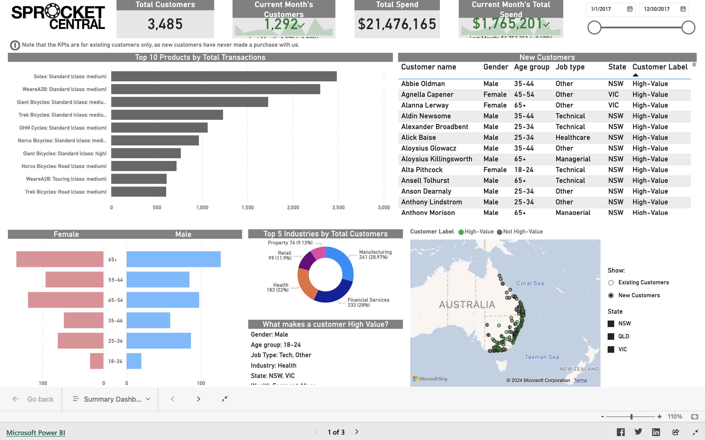

## Final Power BI dashboard and analysis

## Context
For this job simulation project provided by KPMG Australia, I acted as a consultant analyst for a medium-sized bike & cycling accessories company on how to best optimize its marketing strategy with transactional and customer data.

The task is to recommend which of the 1000 new customers should be targeted to drive the most value for the organization in their next marketing campaign.

With the datasets provided, I managed to:
1. Identify and clean the underlying data quality issues.
2. Analyze existing customer data and used the results to identify high value customers for the next marketing campaign.
3. Build a dashboard to present findings and recommendations.
